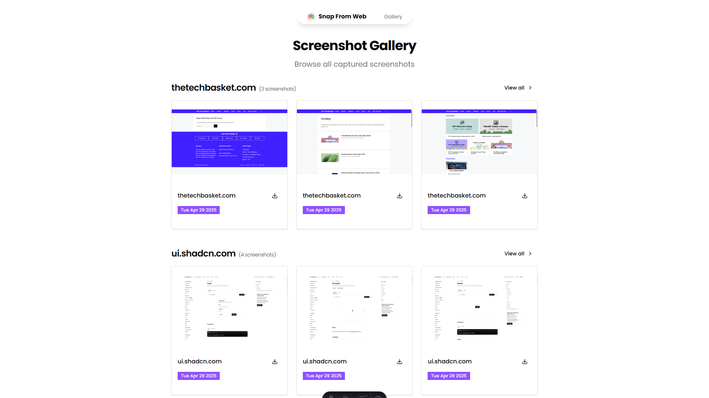

# SnapFromWeb

A web service that captures screenshots of web pages using Puppeteer with stealth mode and ad-blocking capabilities.



## Features

- Single and bulk URL screenshot capture
- Stealth mode to avoid detection
- Ad-blocking for clean screenshots
- Caching of previously captured screenshots
- Concurrent processing using Puppeteer Cluster
- High-quality full-page screenshots
- Caching of previously captured screenshots
- Screenshot Organization by Domain

# Things to remember

- `public/i/` is a reserved directory for screenshots and added in .gitignore file
- `public/og.png` is the preview image that appears when sharing the homepage link

## API Endpoints

### POST /api/screenshot

Captures screenshots of one or more web pages.

#### Request Format

For a single URL:
```json
{
  "urls":["http://localhost:4321/"]
}
```

For multiple URLs:
```json
{
  "urls": [
    "https://example.com",
    "https://example.org"
  ]
}
```

#### Response Format

```json
{
    "success": true,
    "data": {
        "urls": [
            {
                "original": "http://localhost:4321/",
                "screenshot": "http://localhost:4321/i/localhost/ee169604f4cebd35817a28306f40ab7fa34409f0eabb32806cdbad7252aabd53.png"
            }
        ]
    }
}
```

## Development

1. Install dependencies:
```bash
pnpm install
```

2. Start the development server:
```bash
pnpm dev
```

3. Build for production:
```bash
pnpm build
```
